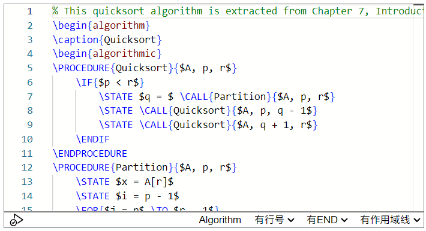
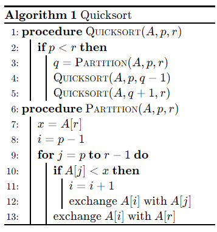

# siyuan-latex-pseudocode

一款让你在思源笔记中优雅地书写和展示伪代码的挂件。

## 使用效果

**编辑模式：**

**显示模式：**

## 功能特征

- [x] 无网络离线使用
- [x] 设置伪代码块的显示风格
- [x] VSCode风格的编辑器
- [x] 语法高亮
- [x] 代码自动补全
- [x] 错误提示

> 如有更多需求/建议欢迎在GitHub仓库中提issuce。

## 更新日志

+ v0.1.0
    + 初始版本
    + 支持无网络离线使用、设置伪代码块的显示风格、VSCode风格的编辑器、语法高亮、代码自动补全、错误提示

## 第三方库

+ [pseudocode.js](saswatpadhi.github.io/pseudocode.js) v2.4.1
+ [katex.js](https://katex.org/) v0.16.22
+ [monaco editor](https://microsoft.github.io/monaco-editor/) v0.52.2